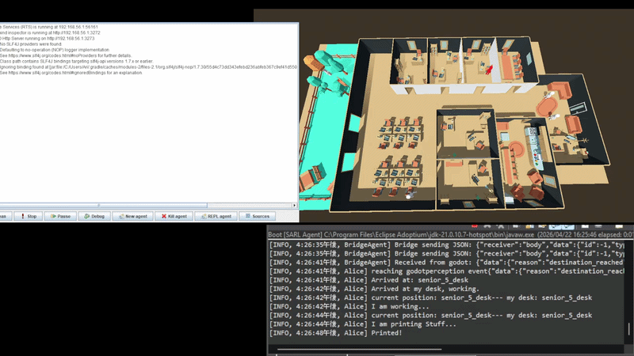

# VEsNA-SARL

VEsNA-SARL is a framework that enables SARL agents to be embodied inside a virtual environment. This repository contains the bridge between agent minds and agent bodies. VEsNA-SARL was built to extend VEsNA from the single use of JaCaMo agents to allow the use of SARL agents (and both together) as well.



## Usage

> [!IMPORTANT]
>
> **Requirements**
>
> - Java  21;
> - Gradle (tested with version 8);
> - Godot 4;
> - SARL 0.15.1 .

### Making a VEsNA agent in SARL

Create a new .sarl agent for the physical body of the new agent, the agent should extend TemplateAgent.sarl.

You may override the new agent's methods however you please to change the way the agent will act, and you can add your own methods.

By default the agent takes a name to identify itself and a port to connect to the virtual environment from its parameters, you can add more by overriding getAdditionalData(), in the function create a 'new JSONObject' and add your agent's parameters in it, and return the JSONObject.toString() .

Note that most of the agent's skills (it's navigation capacity to move around) are in the Skill package so if you want to drastically change something you may want to go there.

The default skill package implements a common navigation template to allow the agents to move in a virtual environment from a currentLoc(ation) to a targetLoc(ation), with a pendingLoc(ation) being the various locations the agent moves through from start to finish.

You will need to implement your own nagivation logic for the agent in computeNextStep() based on your personal project, you can help yourself by using NavigationModel.sarl to put your nagivation functions in to call from the skill.

The sendWalkCommand() method in the skill creates a JSONObject to tell the agent's body in the virtual environment where to move to by emitting a request event to the bridge which will send the message.

The agent class BridgeAgent creates a connection between each agent and its body, to do so each agent will have to emit a RegisterAgent event. The body implements a server with an address and a port.

To communicate with the virtual environment we need to send and receive json objects, we do so by emitting events to either tell the bridge to send an action request, to tell the agents what to do through an answer, or to register the agents to a port through the bridge.

You can add more events in VesnaEvents.sarl (or a separate file); to use them you need to import them like any library.


### Making the VEsNA agent body

To implement your VEsNA body you should implement a websocket Server. The server will receive these messages:

```json
{
    sender: "ag_name",
    receiver: "body",
    type: "msg_type",
    data: {
        type: "inner_type",
        ...
    }
}
```

The `sender` is set to the agent name in the mas.

`msg_type` can be the type of action you implement, like `walk`. 

The `inner_type` is the inner type of the action (like `goto`).

#### Walk message data

The data field for `goto` as the `inner_type` is:

```json
{
 	type: "goto",
    target: "target",
    id: 0 [optional]
}
```

The `target` is the destination you want the body to go to with that json message.

## How to run

In order to run the agents you should:
1. import everything from this repo in sarlide (sarl's ide) and add your agents;
2. create or import a scene in Godot (or Unity or another virtual environment) that implements the map and the body to receive the json messages as described above;
3. start the main scene in godot with `F5`;
4. right click on Boot.sarl in sarl/vesna/agents -> `run` -> `as SARL agent`.

Sometimes after editing some code and saving the ide may give false errors that will prevent the agents from running, in the upper toolbar click on `project` -> `clean...` -> select the project -> `clean`.

If this still doesn't get rid of the errors then they're either real errors to be fixed or the ide needs to be restarted.

### You can also run SARL agents alongside JaCaMo agents

1. create a Godot scene (or other) and run it;
2. create your own jason agents;
3. launch the agents from command line with `gradle run` by using a `build.gradle` file.

Be careful not to start JaCaMo agents with a port already being used by a SARL agent (and viceversa). You can start the agents in either order.